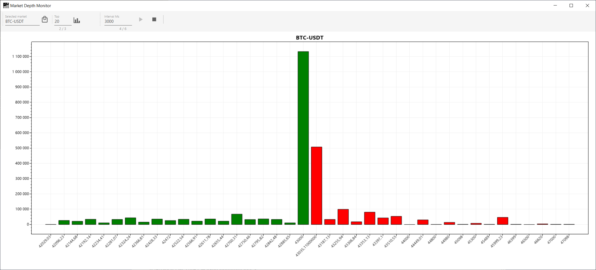

# VRT Market Depth Visualization App

This application show the depth of the selected market  

### Main goals
* It should allow a user to select a market.
* The design should accommodate the addition of more market data providers in the future
* The application should maintain simplicity in its functionality.

## Features

- **Market Selection**: Select a market from the list of all markets from implemented market data providers.
- **Market Filtering**: Filter market by its name.
- **Continues market depth refreshing**: Refresh the market depth chart with the given interval.
- **Setting number of items of the market depth**: Set top number of elements on each side of the market depth chart.
- **Market depth visualization**: Show the market depth in the form of a Bar Chart.

## Supported Market Depth Providers

- **[Binance](https://www.binance.com)** - Crypto Markets Data Provider
- **[Kanga](https://trade.kanga.exchange/?refToken=G0BGYLSzoIih)** - Crypto Markets Data Provider
- **[Interia Biznes](https://biznes.interia.pl/gieldy/notowania-gpw)** - Polish Stock Exchange (GPW) Markets Data Provider

## Building and Installation

1. Open Command Line
1. Clone the repository: `git clone https://github.com/rutkowskit/VRT.MarketDepthApp.git`
1. Navigate to the project directory: `cd VRT.MarketDepthApp`
1. Execute command `dotnet publish -c Release`
1. Copy all files from subfolder `.\VRT.MarketDepth.Lib\bin\Release\net8.0\publish\` to the installation folder.

## License

This project is licensed under the MIT License. See the LICENSE file for details.
